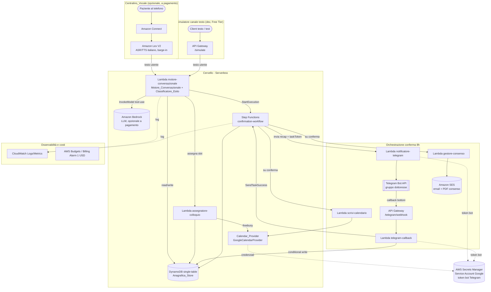

# Centralino AI Studio Medico (Idelia) — Flusso A

Centralino intelligente su AWS per uno studio di psicologia (sede appuntamenti:
**Meda**). Riceve chiamate inbound, dialoga in italiano tramite un LLM su Amazon
Bedrock, raccoglie i dati del paziente secondo il modello del modulo cartaceo,
classifica l'esito della chiamata e — nel caso di richiesta appuntamento —
assegna un primo colloquio a Chiara o Francesca, registra un appuntamento in
`PROVVISORIO`, notifica il gruppo dottoresse su Telegram con una finestra di
conferma di 8 ore, scrive l'evento su Google Calendar e invia al paziente
l'email con il modulo di consenso.

Doppio obiettivo: uso reale per lo studio + artefatto per colloquio AWS
Solutions Architect. Architettura disaccoppiata, IaC in AWS CDK Python, allineata
Well-Architected, costo-zero monitorato, dati finti.

> Stato: implementazione IaC completa (CDK Python). Componenti a pagamento
> (Amazon Connect, Amazon Bedrock reale) disabilitati di default. Vedi
> [Deploy e costi](#deploy-e-costi).

## Indice

- [Architettura](#architettura)
- [Decisioni architetturali chiave](#decisioni-architetturali-chiave)
- [Allineamento Well-Architected](#allineamento-well-architected)
- [Tabella costi per componente](#tabella-costi-per-componente)
- [Deploy e costi](#deploy-e-costi)

**📂 Documentazione estesa (cartella [`docs/`](docs/)):**

- 📄 [Decisioni architetturali & trade-off](docs/decisioni-architetturali.md) — il "perché" di ogni servizio, alternative scartate, narrativa operational → business logic
- 🗺️ [Diagramma visuale dettagliato](https://albesavvy.github.io/centralino-ai-studio-medico/docs/architettura.html) — pagina interattiva con il "perché" di ogni scelta (via GitHub Pages)

## Architettura

Sistema serverless ed event-driven: nessun server always-on. Lo strato voce
(Amazon Connect + Lex V2) e Amazon Bedrock reale sono opzionali e a pagamento; in
sviluppo il flusso intero gira dal **simulatore canale testo** (API Gateway
`/simulate`) a costo zero, con Bedrock mockato.



**Servizi impiegati:** AWS Lambda, Amazon DynamoDB (single-table), AWS Step
Functions, Amazon API Gateway (HTTP), Amazon SES, AWS Secrets Manager, Amazon S3
(PDF consenso), CloudWatch Logs, AWS Budgets/CloudWatch (billing alarm). A
pagamento e gated: Amazon Connect, Amazon Lex V2, Amazon Bedrock reale.

## Decisioni architetturali chiave

Sei questioni aperte risolte in fase di design (dettaglio con i trade-off completi in
[`docs/decisioni-architetturali.md`](docs/decisioni-architetturali.md)):

1. **Dove vive il "cervello".** Amazon Connect -> Lex V2 (thin, solo voce/ASR/TTS)
   -> **Lambda orchestratrice -> Bedrock**. La logica conversazionale vive nella
   Lambda `motore-conversazionale`, non in Lex: massima libertà semantica,
   testabilità senza voce (stessa Lambda invocata dal simulatore) e controllo
   pieno su timeout e fallback.
2. **Modello dati DynamoDB.** **Single-table design** (`centralino-medico`) con
   PK/SK ed entità PATIENT / DOCTOR / APPT / CONTACT / SESSION, più GSI1 (ricerca
   per nome) e GSI2 (appuntamenti per stato). Billing PAY_PER_REQUEST.
3. **Auth Google Calendar.** **Service Account** con chiave JSON in AWS Secrets
   Manager, letta a runtime. Interfaccia astratta `CalendarProvider` +
   `GoogleCalendarProvider` con idempotenza e retry; sink sostituibile senza
   toccare il motore.
4. **Finestra conferma 8h + stati.** **AWS Step Functions** con race tra un
   `Wait (8h)` e un callback `waitForTaskToken` da Telegram. La mutua esclusione
   "vince la prima azione" è garantita da una conditional write su DynamoDB.
5. **Latenza LLM al telefono.** Risposte brevi per default, prompt vincolato,
   streaming ove disponibile, timeout tool-use 10s con fallback a stato
   preservato (nessun dato parziale persistito).
6. **Consenso minori.** Flag `isMinor` derivato dall'età (<18) + `parentName`
   obbligatorio come referente; l'email di consenso è indirizzata al referente e
   mai al minore.

## Allineamento Well-Architected

- **Operational Excellence.** Infrastruttura interamente in AWS CDK Python
  (nessuna risorsa creata a mano), riproducibile e reviewabile. Logging su
  CloudWatch Logs e tracing sulla state machine; tag obbligatori (`Project`,
  `Environment`, `Owner=savinoas`) su tutte le risorse taggabili.
- **Security.** IAM least privilege per singola Lambda (azioni e ARN specifici,
  niente wildcard salvo dove inevitabile e documentato). Encryption at rest su
  DynamoDB, S3, log e Secrets Manager. Credenziali (Service Account Google, token
  bot Telegram) solo in Secrets Manager, mai in chiaro. Webhook Telegram validato
  con secret token. Il campo sensibile `problema` non è usato per l'assegnazione
  né incluso nel recap Telegram.
- **Reliability.** Nessuna perdita di dati e nessun evento duplicato: idempotenza
  della scrittura calendario (chiave = `appointment_id`), conditional write sulle
  transizioni di stato, retry con tetti espliciti (calendario max 3, numero
  cliente max 5, email max 3). Rollback automatico dello stack su deploy fallito.
- **Performance Efficiency.** Architettura serverless event-driven senza risorse
  always-on; DynamoDB single-table con GSI mirati per ricerca per nome e per
  stato; risposte LLM brevi per contenere la latenza sul canale vocale.
- **Cost Optimization.** Costo-zero monitorato: Free Tier dove possibile,
  componenti a pagamento (Connect, Bedrock) disabilitati di default e gated dal
  flag `paid_components_enabled`, DynamoDB on-demand (nessuna capacità
  pre-provisionata), billing alarm a 1 USD, `cdk destroy` per non lasciare
  risorse orfane.
- **Sustainability.** Nessun idle compute (tutto on-demand/serverless), retention
  dei log breve, volumi di test minimi sui componenti a pagamento.

## Tabella costi per componente

Una riga per componente del sistema con copertura Free Tier (sì/no) e costo
unitario stimato oltre il Free Tier (Requirement 10.5). Stime indicative da
confermare con il price list ufficiale della region al momento dell'attivazione.

| Componente | Free Tier | Costo unitario stimato oltre Free Tier |
|-----------|-----------|----------------------------------------|
| AWS Lambda | Sì | ~0,20 USD per 1M richieste + GB-secondi |
| Amazon DynamoDB (on-demand) | Sì (25 GB, 25 WCU/RCU equivalenti) | ~1,25 USD per 1M scritture, ~0,25 USD per 1M letture |
| AWS Step Functions (Standard) | Sì (4.000 transizioni/mese) | ~0,025 USD per 1.000 transizioni di stato |
| Amazon API Gateway (HTTP) | Sì (1M chiamate/mese primo anno) | ~1,00 USD per 1M richieste |
| Amazon SES | Parziale (invio da app AWS) | ~0,10 USD per 1.000 email + costo allegati/dati |
| AWS Secrets Manager | No | ~0,40 USD per segreto/mese + API |
| Amazon S3 (PDF consenso) | Sì (5 GB primo anno) | ~0,023 USD per GB/mese |
| CloudWatch Logs | Sì (5 GB) | ~0,50 USD per GB ingerito |
| **Amazon Connect** | No (numero + minuti) | numero telefonico + tariffa al minuto (a consumo) |
| **Amazon Bedrock** | No | costo per token input/output (dipende dal modello) |

Amazon Connect e Amazon Bedrock sono gli unici componenti che richiedono
attivazione manuale esplicita e non sono coperti dal Free Tier.

## Deploy e costi

Prerequisiti: Python 3.12, AWS CDK, credenziali AWS configurate. La metrica di
billing `EstimatedCharges` è pubblicata solo in `us-east-1`: lo stack è pinnato a
quella region così il billing alarm funziona.

```bash
# 1. Ambiente virtuale e dipendenze
python -m venv .venv
.venv\Scripts\activate            # Windows PowerShell
pip install -r requirements.txt

# 2. Ricostruire i Lambda layer (vedi sezione "Ricostruire i layer")
pip install -r layers/google/requirements.txt -t layers/google/python

# 3. Verifica del template (costo-zero: nessuna risorsa creata)
cdk synth

# 4. Bootstrap una tantum dell'ambiente (solo la prima volta)
cdk bootstrap

# 5. Deploy (default: componenti a pagamento DISABILITATI)
cdk deploy

# 6. Distruzione dello stack (rimuove tutte le risorse, nessuna orfana)
cdk destroy
```

### Ricostruire i layer

Le dipendenze di terze parti dei Lambda layer (librerie Google per Calendar,
ecc.) **non sono versionate**: `layers/*/python/` è escluso dal `.gitignore` per
non gonfiare il repo con migliaia di file di terzi. Dopo un clone del repo vanno
reinstallate in locale prima del deploy:

```bash
# Ricostruisce il layer Google dentro layers/google/python
pip install -r layers/google/requirements.txt -t layers/google/python
```

La cartella `python/` è la struttura richiesta da AWS Lambda per i layer. Resta
solo in locale: `cdk deploy` la impacchetta e la carica, ma non finisce su Git.

### Flag componenti a pagamento (`paid_components_enabled`)

Di default `false`: Amazon Connect, Amazon Lex V2 e Amazon Bedrock reale non
vengono provisionati (la synth non produce alcuna risorsa per quei servizi) e il
motore usa Bedrock mockato. L'intero flusso resta testabile a costo zero dal
simulatore canale testo (`POST /simulate`).

```bash
# Deploy CON i componenti a pagamento (Connect + Lex + Bedrock reale)
cdk deploy -c paid_components_enabled=true

# Selezione dell'ambiente (tag Environment: dev | test | prod; default dev)
cdk deploy -c environment=dev
```

Il valore di default è anche in `cdk.json` (`context.paid_components_enabled`).

> ⚠️ **Avviso costi — Connect e Bedrock.** Attivare `paid_components_enabled=true`
> provisiona componenti a pagamento: Amazon Connect (numero telefonico + tariffa
> al minuto) e Amazon Bedrock reale (costo per token). Non sono coperti dal Free
> Tier. Attivarli solo con billing alarm già in piedi, a basso volume (max 10
> invocazioni per sessione di test) e con conferma esplicita. Esegui `cdk destroy`
> al termine dei test per non lasciare risorse a consumo attive.

Un billing alarm a soglia 1 USD (metrica `AWS/Billing EstimatedCharges` in
`us-east-1`) notifica via SNS al superamento della soglia, come rete di sicurezza
sul principio costo-zero.
